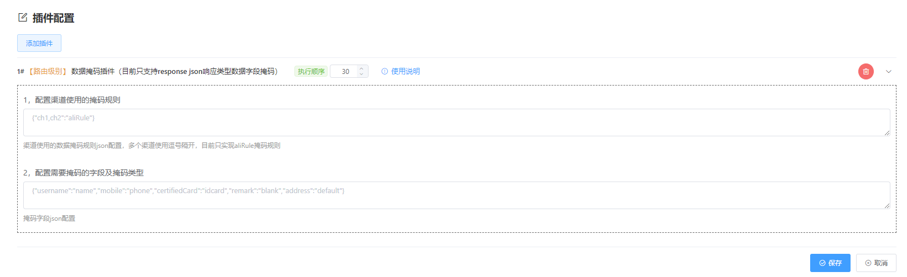
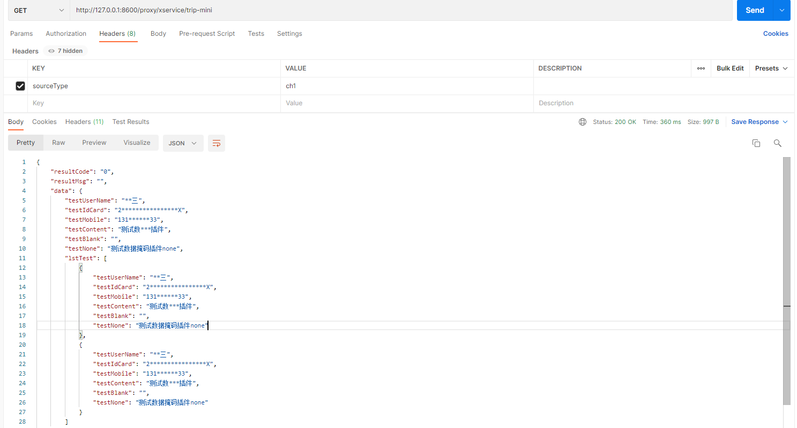

## 1，概述

基于fizz的插件机制，对返回响应类型为`application/json`的数据进行字段掩码处理

## 2，使用说明
I、gateway项目pom文件中引入以下依赖：

```xml
<dependency>
    <groupId>com.fizzgate</groupId>
    <artifactId>fizz-plugin-data-mask</artifactId>
    <version>2.3.4-beta2</version>
</dependency>
```

II. 管理后台导入以下SQL

 ```sql
 INSERT INTO `tb_plugin` (`fixed_config`, `eng_name`, `chn_name`, `config`, `order`, `instruction`, `type`, `create_user`, `create_dept`, `create_time`, `update_user`, `update_time`, `status`, `is_deleted`) 
 VALUES (NULL, 'maskingPlugin', '数据掩码插件（目前只支持response json响应类型数据字段掩码）', '[{"field":"maskingRule","label":"1，配置渠道使用的掩码规则","component":"textarea","dataType":"string","desc":"渠道使用的数据掩码规则json配置，多个渠道使用逗号隔开，目前只实现aliRule掩码规则","placeholder":"{\"ch1,ch2\":\"aliRule\"}","default":""},{"field":"maskingTemplate","label":"2，配置需要掩码的字段及掩码类型","component":"textarea","dataType":"string","desc":"掩码字段json配置","placeholder":"{\"username\":\"name\",\"mobile\":\"phone\",\"certifiedCard\":\"idcard\",\"remark\":\"blank\",\"address\":\"default\"}","default":""}]', 30, ' 1. 基于请求头sourceType配置掩码规则，请求头需传入sourceType参数。
 2. 配置渠道使用的掩码规则，可以多个渠道配置同一规则：{"ch1,ch2":"aliRule"}。不同渠道配置不同规则：{"ch1":"aliRule"}，{"ch2":"customRule"}。所有渠道使用使用同一规则：{"*":"aliRule"}。同一渠道配置多个规则以第一个匹配为准，*优先级最低。
 3. 配置需要掩码的字段及掩码类型：{"username":"name","mobile":"phone","certifiedCard":"idcard","remark":"blank","address":"default"}，key为需要掩码的字段（例如：username,mobile等）。value为掩码类型，name--用户名掩码，phone--电话手机号掩码，idcard--身份证证件号掩码，blank--处理为空字符串，default--默认掩码（如支付宝掩码规则显示前 1/3 和后 1/3，其他用 * 号代替）。', 2, NULL, NULL, NULL, NULL, NULL, 1, 0);
 ```

更多网关二次开发请参考[网关快速开发](https://www.fizzgate.com/fizz/guide/fast-dev/fast-dev.html) 、[插件开发样例](https://www.fizzgate.com/fizz/guide/plugin/)

III、可在Fizz Admin管理系统中网关管理->插件管理中配置maskingPlugin插件来实现响应数据掩码。
配置使用说明：
1. 插件基于请求头sourceType参数配置掩码规则，请求头需传入sourceType参数
2. 配置渠道使用的掩码规则，可以多个渠道配置同一规则：`{"ch1,ch2":"aliRule"}`。不同渠道配置不同规则：`{"ch1":"aliRule"}`，`{"ch2":"customRule"}`。所有渠道使用使用同一规则：`{"*":"aliRule"}`。同一渠道配置多个规则以第一个匹配为准，*优先级最低   
3. 配置需要掩码的字段及掩码类型：`{"username":"name","mobile":"phone","certifiedCard":"idcard","remark":"blank","address":"default"}`，key为需要掩码的字段（例如：`username,mobile`等）。value为掩码类型，name--用户名掩码，phone--电话手机号掩码，`idcard`--身份证证件号掩码，blank--处理为空字符串，default--默认掩码（如支付宝掩码规则显示前 1/3 和后 1/3，其他用 * 号代替）。


## 3，插件效果
